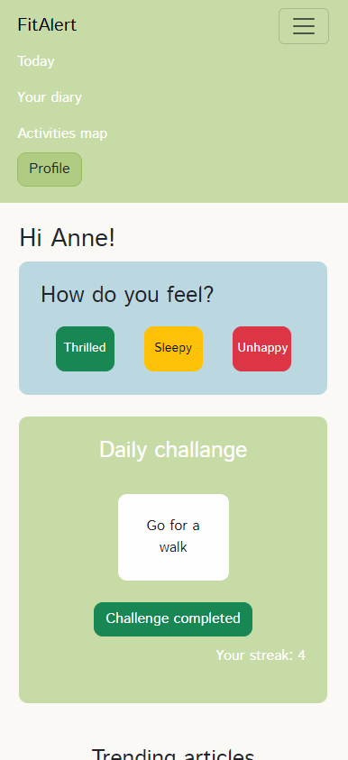
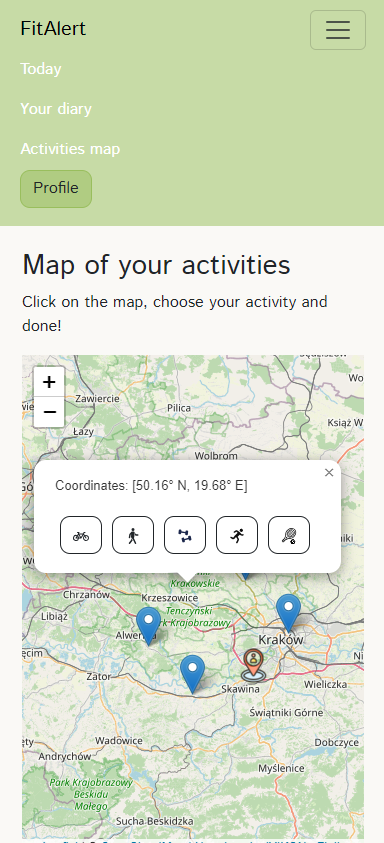
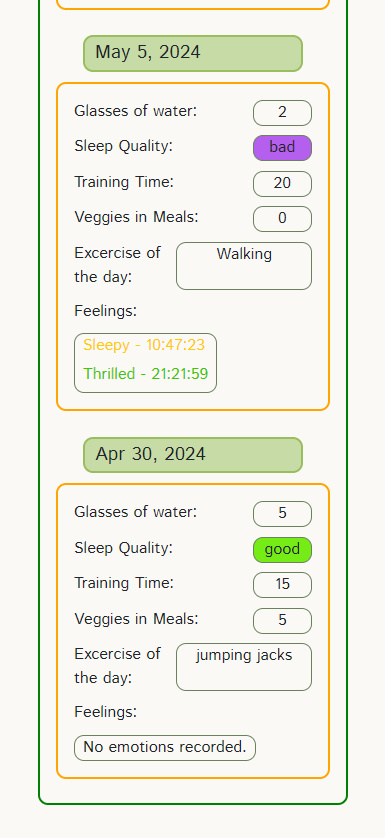

# FitAlert

This is app to help you track your healthy habits. You can save information on sleep, water drank, mood and even mark physical activities on map! Try new healthy things with daily challenges and read some advice from our articles.

## Peak into app

  

## Information for other project tasks

1. Prototype: [Link to prototype in Figma](https://www.figma.com/proto/xZJqp9e9Yo9wVWBARvIY9C/fitAlert?type=design&node-id=3-3&t=z6xd8NBxAOvJm0oU-1&scaling=scale-down&page-id=0%3A1&starting-point-node-id=3%3A3&show-proto-sidebar=1)
2. Hosting: https://fit-alert-62706.web.app/
3. Use cases UML: `use_cases_FitAlert.pdf`

## Creators

- [Kamila-Kapinos](https://github.com/Kamila-Kapinos)
- [JustynaGargula](https://github.com/JustynaGargula)
- [bcharN](https://github.com/bcharN)

## Angular related information

This project was generated with [Angular CLI](https://github.com/angular/angular-cli) version 17.3.4.

Run `ng serve` for a dev server. Navigate to `http://localhost:4200/`. The application will automatically reload if you change any of the source files.

Run `ng build` to build the project. The build artifacts will be stored in the `dist/` directory.

To get more help on the Angular CLI use `ng help` or go check out the [Angular CLI Overview and Command Reference](https://angular.io/cli) page.
